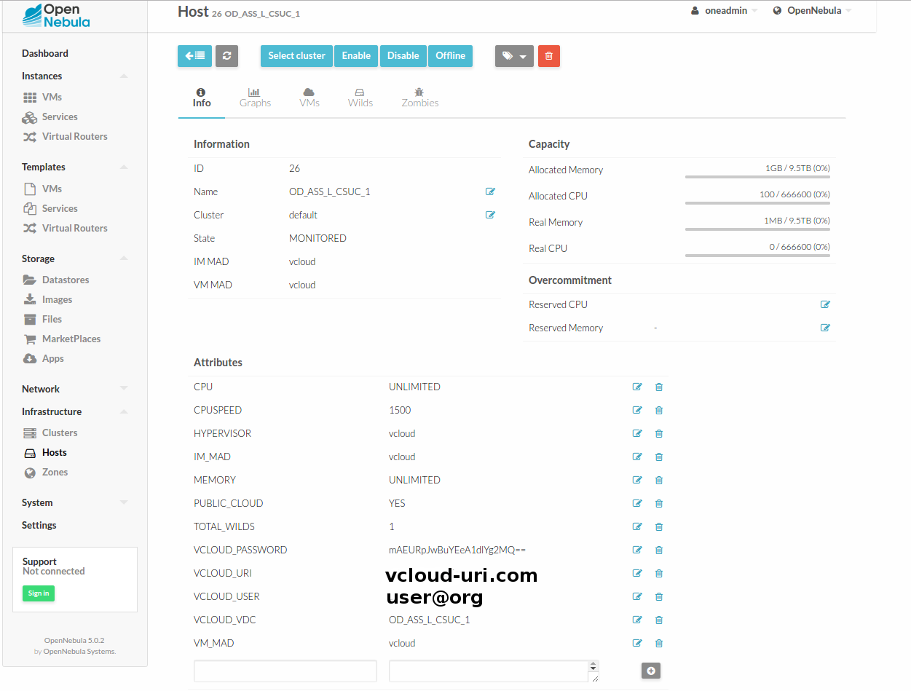

# VCLOUD DRIVER. Installation and Configuration Guide

## TABLE OF CONTENTS

* Install OpenNebula
* Install vCloud Driver
    * Download and copy files
    * Change permissions and owner
    * Modify /etc/one/oned.conf
    * Restart OpenNebula service
* Install 'ruby_vcloud_sdk'
    * Install dependencies
    * Install gem
* Import hosts,templates,networks,datastores
* Usage
    * First Steps
    * Template's Context Variables
    * User's Context Variables
* FAQ

## INSTALL OPENNEBULA

[http://docs.opennebula.org/5.0/deployment/opennebula_installation/index.html](http://docs.opennebula.org/5.0/deployment/opennebula_installation/index.html)


## INSTALL VCLOUD DRIVER FOR OPENNEBULA (IN THE FRONTEND)

### 1.Download and copy the files in their respective directories:

    - 5.0/remotes/vmm/vcloud 				  	-> /var/lib/one/remotes/vmm/
    - 5.0/remotes/im/vloud.d 					-> /var/lib/one/remotes/im/
    - 5.0/remotes/datastore/vcloud 				-> /var/lib/one/datastore
    - 5.0/remotes/hooks/dv            -> /var/lib/one/remotes/hooks
    - 5.0/remotes/vmm/vcloud/vcloud_driver.rb 	-> /usr/lib/one/ruby

### 2.Change permissions and owner:

 	 chown -R oneadmin:oneadmin /var/lib/one/remotes/vmm/vcloud /var/lib/one/remotes/im/vcloud.d /var/lib/one/remotes/datastore/vcloud /var/lib/one/remotes/hooks/dv

 	 chmod -R +x /var/lib/one/remotes/vmm/vcloud /var/lib/one/remotes/im/vcloud.d /var/lib/one/remotes/datastore/vcloud /var/lib/one/remotes/hooks/dv

### 3.Modify the /etc/one/oned.conf configuration file adding the following new lines

* In IM_MAD section:
  
  		 #-------------------------------------------------------------------------------
   		 #  VMware vCloud Director Information Driver Manager Configuration
  		 #-------------------------------------------------------------------------------
		 IM_MAD = [
      		name       = "vcloud",
      		executable = "one_im_sh",
      		arguments  = "-c -t 15 -r 0 vcloud"]
   		#-------------------------------------------------------------------------------

* In VM_MAD section:
 
   		 #-------------------------------------------------------------------------------
    	 #  VMware vCloud Director Virtualization Driver Manager Configuration
    	 #-------------------------------------------------------------------------------
     	 VM_MAD = [
    		name       = "vcloud",
    		executable = "one_vmm_sh",
    		arguments  = "-p -t 15 -r 0 vcloud -s sh",
    		type       = "xml" ]
		#------------------------------------------------------------------------------

* In HOOK section:
      ```
       #-------------------------------------------------------------------------------
       #   VMware vCloud Director Hook Manager Configuration
       #-------------------------------------------------------------------------------
       VM_HOOK = [
        name = "delete_poweroff_vms",
        on = "DONE",
        command = "dv/delete_poweroff_vms.rb",
        arguments = "$TEMPLATE" ]
       #-------------------------------------------------------------------------------
       VM_HOOK = [
        name      = "delete_failed_vms",
        on        = "CUSTOM",
        state     = "ACTIVE",
        lcm_state = "BOOT_FAILURE",
        command   = "dv/delete_failed_vms.rb",
        arguments = "$TEMPLATE" 
       ]
       #-------------------------------------------------------------------------------
       ```


* In TM_MAD section:

		We need to add vcloud as a argument.This section must be like this:
    
    	TM_MAD = [
    		executable = "one_tm",
    		arguments = "-t 15 -d dummy,lvm,shared,vcloud,fs_lvm,qcow2,ssh,vmfs,ceph,dev"
		]

* In DS_MAD section:

		We need to add vcloud as a argument.This section must be like this:
    
   		DATASTORE_MAD = [
    		executable = "one_datastore",
    		arguments  = "-t 15 -d dummy,vcloud,fs,vmfs,lvm,ceph,dev"
		]
    

* Add the following lines at the end of the file in the Transfer Manager Driver Behavior Configuration section:

    	TM_MAD_CONF = [
    		name = "vcloud", ln_target = "NONE", clone_target = "NONE", shared = "yes"
		]

		DS_MAD_CONF = [
    		NAME = "vcloud", REQUIRED_ATTRS = "VCLOUD_HOST", PERSISTENT_ONLY = "YES",
    		MARKETPLACE_ACTIONS = "export"
		] 

### 4.Restart ONE service.

 	service opennebula restart

# INSTALL 'ruby_vcloud_sdk'

As a root:

### 1.Install dependencies

	apt-get install make g++ ruby-dev zlib1g-dev liblzma-dev 

### 2.Download and install the gem

	gem install ruby_vcloud_sdk-[current_version].gem


## IMPORT HOSTS,TEMPLATES, NETWORKS AND DATASTORE USING ONEVCLOUD SCRIPT

When vCloud Driver is installed correctly, it's time to use onevcloud script to import the resources of vCloud.

	/var/lib/one/remotes/vmm/vcloud/onevcloud [hosts | templates | networks | datastores] --vcloud [vcloud-uri.com] --vuser [user@organization] --vpass [password] --vdc [VDC_name]

## USAGE

### FIRST STEPS

The first step is import to OpenNebula the resources hosted in vCloud using the onevcloud script.

###Hosts
  ```
  /var/lib/one/remotes/vmm/vcloud/onevcloud hosts --vcloud [vcloud-uri.com] --vuser [user@organization] --vpass [password] --vdc [VDC_name]
  ```



###Templates
  ```
  /var/lib/one/remotes/vmm/vcloud/onevcloud hosts --vcloud [vcloud-uri.com] --vuser [user@organization] --vpass [password] --vdc [VDC_name]
  ```


###Networks

  For the current version, only POOL addressment is supported. OpenNebula generates MAC addresses and passes them to vCloud. 
  For that reason, when you use the script to import networks to OpenNebula you must to choose [E]thernet type network.

  ```
  /var/lib/one/remotes/vmm/vcloud/onevcloud networks --vcloud [vcloud-uri.com] --vuser [user@organization] --vpass [password] --vdc [VDC_name]
  ```


##Intanciate Templates

  When the resources are imported correctly, we can start to instanciate templates!


### TEMPLATE'S CONTEXT VARIABLES

During the instanciation, vcloud driver takes some variables from the template to configure capabilities such as CUSTOMIZATION. If this variables are not in the template, the capabilities won't be configured correctly. Please add or modify the variables that you need.

* CUSTOMIZATION = "YES"               The DEFAULT value is NO. If you want to activate customization, change the value to "YES".
* OS = "LINUX | WINDOWS | OTHER"      Check this variable and modify the value for the OS of the template. This value is important because is used during the customization process.
* WHITE_TCP_PORTS = "PORT,PORT,..."   If you add coma-separated TCP port numbers, during the instanciation the driver will open that ports in the vShield. Only if the network is
                                      enrouted by vShield.
 
### USER'S CONTEXT VARIABLES

If you activate the customization and the template supports it, during the instaciation a user will be created. This variables must be set in the "User Settings" tab in Sunstone.

* PASS      [Hash]        This information will be the password for your user in LINUX OS      
* PASS_WIN  [Clear Text]  This information will be the password for your user in WINDOWS OS   
* ROOT_PASS [Clear Text]  This information will be the password for the root/Administrator in LINUX/WINDOWS OS

If you add a Public SSH Key for that user, it will be added to the Linux VM during its instanciation.

## FAQ
