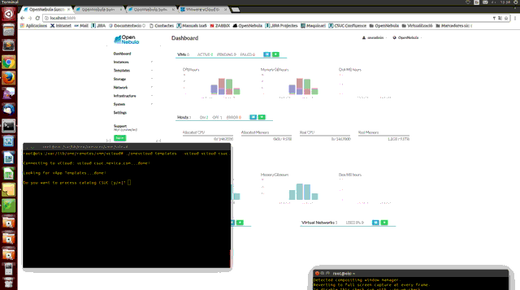

# Addon vCloud Driver

## Description

This addon gives Opennebula the posibility to manage resources in VMware vCloud infraestructures. 
It includes virtualization and monitoring drivers.

This driver is based on [vCenter Driver](https://github.com/OpenNebula/one/blob/master/src/vmm_mad/remotes/vcenter/vcenter_driver.rb) and uses a
modified version of [ruby_vcloud_sdk](https://github.com/vchs/ruby_vcloud_sdk).

This is the readme for the current development version. 

## Features

This addon has the following capabilities:

* Deploy, stop, shutdown, reboot, save, suspend, resume and delete VM's in the Virtual Data Centers hosted in vCloud.
* Create, delete and revert snapshots of VM's.
* Change RAM and CPU values of VM.
* It's able to hot-attach and detach NICs to VM's.
* Attach disks to VM. Now, during the deployment process only.
* Automatized customization of the VMs instanciated.
* Port filtering via vShield during the VM instanciation.
* Obtain monitoring information from the VDC, Datastore and VM's.
* In this development version we manage vApps with one VMs inside (A VM in OpenNebula equals a vApp with one VM in vCloud).
* Each Virtual Data Center (VDC) in vCloud is managed as a Host in OpenNebula.
* Import networks, hosts, templates and datastores hosted in vCloud using onevcloud script.

## Demo

In this video you can see how to instantiate a new imported vm template

## Development

To contribute bug patches or new features, you can use the github 
Pull Request model. It is assumed that code and documentation are 
contributed under the Apache License 2.0. 

More info: 

* [How to Contribute] (http://opennebula.org/software:addons#how_to_contribute_to_an_existing_add-on) 
* Support: [OpenNebula user forum](https://forum.opennebula.org/c/support)
* Development: [OpenNebula developers forum](https://forum.opennebula.org/c/development)
* Issues Tracking: [Github issues] (https://github.com/OpenNebula/addon-vcloud-driver/issues)

## Authors

Leaders: Miguel Ángel Flores (miguel.angel.flores@csuc.cat), Xavier Peralta (xavier.peralta@csuc.cat), Arnau Colominas (arnau.colominas@csuc.cat)

[CSUC - Consorci de Serveis Universitaris de Catalunya] (http://www.csuc.cat)

## Compatibility

* This addon was tested on OpenNebula 5.X
* OS supported: 
	* Ubuntu 14
	* Debian 8
* It works with vcloud API version 5.5 [+Info] (https://developercenter.vmware.com/web/sdk/5.5.0/vcloud-api)

## Installation, Configuration and Usage

Use [this guide](Guide.md)

## References

[CSUC] (http://www.csuc.cat)  [OpenNebula] (http://opennebula.org/)

## License

[Apache 2.0] (LICENSE)
